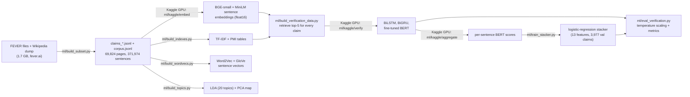
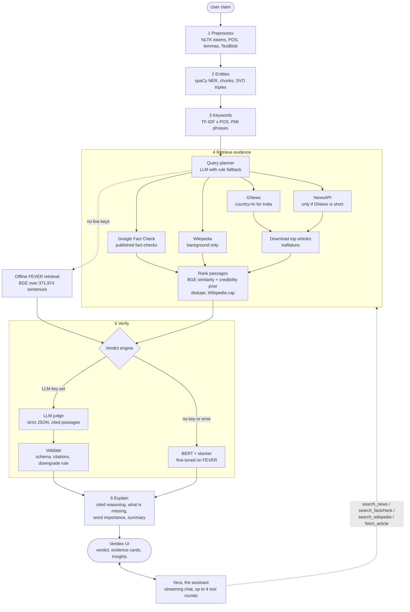
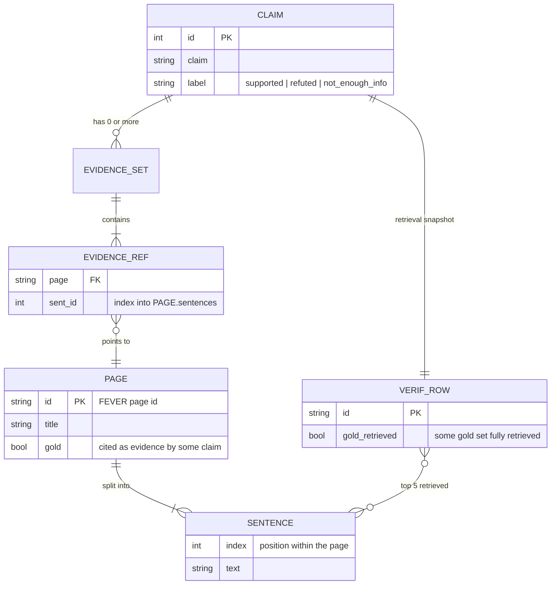

<div align="center">


# VERIDEX

### *Verify before you share.*

Evidence-based fact-checking for the news you actually read, with **Vera**, an AI investigative-journalist sidekick.

<br/>

<p>
  
  
  
  
  
  
  
</p>
<p>
  
  
  
  
  
  
  
</p>
<p>
  
  
  
  
  
  
  
</p>
<p>
  
  
  
  
  
  
</p>

<br/>

**Natural Language Processing Laboratory Project: Semester VII**<br/>
Faculty of Engineering and Technology, **GLS University**<br/>
B.Tech (CS&E)

<br/>

| &nbsp;By&nbsp; | Enrollment No. |
|:---|:---:|
| **Amulya Anamdasu** | `202302626010004` |
| **Dhiptanshu Malik** | `202302626010036` |
| **Khush Purohit** | `202302626010061` |

**Submitted to:** Dr. Aakanksha Jain

</div>

---

## Contents

1. [What is Veridex?](#what-is-veridex)
2. [Features and tabs](#features-and-tabs)
3. [Datasets and data sources](#datasets-and-data-sources)
4. [How the models were trained](#how-the-models-were-trained)
5. [Methodologies and NLP concepts](#methodologies-and-nlp-concepts)
6. [Results](#results)
7. [The pipeline, explained](#the-pipeline-explained) (with its diagram)
8. [Setup and installation](#setup-and-installation)
9. [Project structure](#project-structure)
10. [Data and database schemas](#data-and-database-schemas)
11. [API reference](#api-reference)
12. [Testing, limitations and ethics](#testing-limitations-and-ethics)
13. [References](#references)

---

## What is Veridex?

**Veridex** is a fact-checking workbench. You paste a claim, a headline or a forwarded message, and it tells you whether the
evidence **supports** it, **refutes** it, or is **not enough** to decide, and it shows *why*, with every source linked.

Most fake-news projects classify text by its wording alone, which is brittle and cannot explain itself. Veridex does what a
human fact-checker does instead:

1. **Understands** the claim (people, places, key terms).
2. **Searches** live Indian and global news, published fact-checks (Alt News, BOOM, PIB Fact Check, AFP, ...) and Wikipedia
   background, in parallel.
3. **Reads** the full text of the best articles and ranks passages by relevance and by how credible the source is.
4. **Judges** the claim against those passages with a language-model judge (or, offline, a fine-tuned BERT verifier).
5. **Explains** the verdict with cited passages, what is missing, and which words mattered.
6. Lets you **keep digging with Vera**, an assistant who searches the web on her own when the evidence on screen is not enough.

Underneath the live system sits a rigorous, reproducible **NLP benchmark**: the FEVER fact-verification dataset, a
classical-to-neural ladder of retrievers and verifiers (TF-IDF, Word2Vec, GloVe, BGE, BiLSTM, BiGRU, BERT), calibrated
probabilities, and a measured explanation module. Every number in this README comes from a script in [`ml/`](ml) and a saved
result in [`docs/results`](docs/results).

> **A claim you cannot verify is not a claim you should share.** Veridex treats "not enough information" as a first-class answer.
> Its verdicts are a decision aid, not an authority: always read the cited sources.

<div align="center">

| Live evidence | Judge | Explanation | Assistant |
|:---:|:---:|:---:|:---:|
| GNews, NewsAPI, Google Fact Check, Wikipedia | LLM judge, BERT fallback | cited reasoning, word heat-map, what is missing | **Vera**, with web search tools |

</div>

---

## Features and tabs

Veridex is a single-page app with a floating sidebar (light and dark themes, `Ctrl + K` command palette). Every tab is
linkable, for example `http://localhost:8000/#/compare`.

| Tab | What it does |
|---|---|
| **Verify** | The main screen. One claim streams through the pipeline stage by stage. A hero card shows the verdict, a confidence ring, nuance ("partly true", "misleading", "outdated"...) and warnings. Tabs below show the **Explanation** (cited reasoning and what is missing), the **Evidence** (news / fact-check / Wikipedia cards with source, date, credibility tier and link), the **Pipeline** internals (tokens, POS tags, entities, keywords) and a **Semantic map** (PCA of the claim and evidence). *Real FEVER claims* loads a random benchmark claim and shows FEVER's own label next to the verdict. |
| **Vera** | A free-form chat with the assistant, no claim needed. She answers from the current result when there is one, and otherwise searches news and fact-checkers herself, citing every source. Chats are saved as sessions in your browser: reopening the app starts a fresh chat, switching tabs keeps your current one, and **Recent chats** reopens, searches or deletes older ones. |
| **Compare** | Run one claim through up to three pipeline configurations side by side (live news + LLM judge, offline Wikipedia + BERT, claim-only baseline, BiLSTM, ...), with a banner when they disagree and a full result view for each. |
| **Batch** | Check up to 100 claims at once (paste or upload `.txt` / `.csv`). Add `claim,label` to get an accuracy score for your own labelled data. Click any row for the full explanation and evidence. Export CSV or JSON. |
| **History** | Every verify, compare and batch run, saved in your browser only. Search, filter, re-run, export, delete. |
| **Data** | Browse the real FEVER claims, their gold evidence sentences and the corpus statistics. |
| **Insights** | Every evaluation result as charts and tables: retrieval ablations, training curves, confusion matrix, explanation quality, the judge-model benchmark, the LIAR transfer test and LDA topics. |
| **Pipeline** | Live status of every model, index and external service (never showing key values) with the exact fix command for anything missing, plus the catalogue of every interchangeable stage implementation. |
| **Settings** | Theme (system / light / dark), default pipeline options, privacy notes, clear saved data. |

**Vera, the assistant.** A warm, curious investigative journalist who reasons like a reporter (who said it, what is the primary
source, what is missing) and stays calm and kind on serious topics. She streams answers, cites sources as `[n]`, labels anything
that is general knowledge, and uses four tools: `search_news`, `search_factcheck`, `search_wikipedia` and `fetch_article`.
She is an AI and says so; she cannot phone anyone, and she tells you when she could not confirm something.

---

## Datasets and data sources

### Training and evaluation data

| Dataset | What it is | How it is used here |
|---|---|---|
| **FEVER** (Thorne et al., 2018) | 185k human-written claims about Wikipedia facts, each labelled *Supported*, *Refuted* or *NotEnoughInfo*, with gold evidence sentences. Files: `train.jsonl`, `shared_task_dev.jsonl`, and the June-2017 `wiki-pages` dump from [fever.ai](https://fever.ai/dataset/fever.html). | The core benchmark. Claims train and evaluate the retrievers, the verifiers and the explanation module. |
| **Veridex evidence corpus** (built here) | A bounded subset of the Wikipedia dump: **69,824 pages / 371,974 sentences** (9,772 pages cited as gold evidence + 60,052 random distractor pages). | The search space for offline retrieval. Small enough to embed and search on a laptop. |
| **Claim splits** (built here) | **train 39,729** and **val 3,977** claims carved from FEVER `train.jsonl`; **test 19,868** claims from FEVER's labelled `shared_task_dev.jsonl` (balanced three ways). | All model selection uses val; test is touched once, at the end. |
| **LIAR** (Wang, 2017) | 12.8k PolitiFact statements with six truthfulness labels. | A second-dataset study: claim-only text classifiers, and a cross-domain transfer test of the FEVER-trained pipeline. |

### Pretrained models and vectors

| Resource | Used for |
|---|---|
| `bert-base-uncased` (Devlin et al., 2019) | Fine-tuned into the FEVER verifier (offline verdict engine and fallback). |
| `BAAI/bge-small-en-v1.5` (384-d) | Default dense retriever (also ranks live news passages). |
| `sentence-transformers/all-MiniLM-L6-v2` (384-d) | Alternative, smaller dense retriever. |
| GloVe 100-d (Wikipedia + Gigaword, via Gensim) | Initialises the BiLSTM / BiGRU and one retrieval variant. |
| Word2Vec (trained on the corpus with Gensim) | A word-vector retrieval variant. |
| `sshleifer/distilbart-cnn-6-6` | Optional abstractive evidence summary. |
| `deepset/minilm-uncased-squad2` | Local extractive question answering (offline fallback for follow-ups). |
| spaCy `en_core_web_sm`, NLTK data (punkt, stopwords, WordNet, tagger) | Linguistic analysis. |

### Live data sources (all optional; keys in `backend/.env`)

| Source | Role | Notes |
|---|---|---|
| **GNews** | Main news search; `country=in` for India-related claims | free plan: 100 requests/day |
| **NewsAPI** | Second news source when GNews finds few articles | free plan: 100 requests/day |
| **Google Fact Check Tools API** | Published fact-checks as the strongest evidence tier | free key from Google Cloud |
| **Wikipedia API** | Background context only, capped so it never outranks news | no key; contact string required |
| **AICredits** (OpenAI-compatible) | LLM calls: query planning, judge, Vera | judge default `anthropic/claude-sonnet-4.6`; planner and chat `openai/gpt-4o-mini` |

Live sources are not training data: nothing from them is used to train any model.

---

## How the models were trained

All heavy training ran on a free **Kaggle GPU (T4)**; everything else runs on a laptop CPU. Hyper-parameters are fixed in the
scripts and every split choice was made on validation data only.



**1. Data preparation** (`ml/build_subset.py`). The wiki-pages zip is streamed (never extracted). Pages cited as gold evidence are
always kept; 60,052 random pages are added so retrieval is a real search problem. Wikipedia markup is cleaned and each page is
split into sentences whose index equals FEVER's sentence id, so gold evidence can be matched exactly. Claims whose gold
sentences are missing are dropped and counted (271 train, 23 val, 130 test).

**2. Retrievers.**
- *TF-IDF* with unigram + bigram features (up to 600k, English stop-words removed) over pages, with sentences re-ranked inside the
  best pages, plus a **title bonus** (a page whose title appears in the claim, found by n-gram or NER matching, is boosted; boost
  tuned on val).
- *Word2Vec* trained on the corpus and *GloVe 100-d*: IDF-weighted average word vectors, fused with TF-IDF (weights tuned on val).
- *MiniLM* and *BGE-small* embeddings of `"<title>. <sentence>"` for all 371,974 sentences, computed on the Kaggle GPU in about
  3 minutes (max length 128, L2-normalised, stored as float16). Retrieval is cosine similarity.

**3. Verifiers** (`ml/kaggle/verify/train.py`, seed 13). Inputs are the claim plus the top-5 sentences **our retriever returns**,
so reported accuracy describes the whole pipeline rather than a gold-evidence shortcut.
- *BiLSTM / BiGRU*: GloVe-initialised and frozen (vocabulary of words seen at least twice), claim and evidence encoded
  separately by a bidirectional recurrent layer (128 units each way) and max-pooled; the two encodings, their absolute difference
  and their product are concatenated and passed through a 256-unit ReLU layer with dropout 0.3. Adam, learning rate 1e-3, 6 epochs, best epoch kept.
- *BERT*: `bert-base-uncased`, input `[CLS] claim [SEP] evidence`, max length 256, **2 epochs on 75,571 examples**, AdamW at
  2e-5 with linear warm-up and decay, fp16. For supported and refuted claims the training evidence mixes the gold sentences
  with retrieved ones, so the model sees realistic noise; not-enough-info claims use retrieved evidence; single-sentence
  examples are added so the model can also rate one sentence on its own.
- *Claim-only baseline*: TF-IDF (1-2 grams) + logistic regression on the claim text alone, to measure how much evidence adds.

**4. Stacker** (`ml/train_stacker.py`). BERT scores the claim against each of the 5 sentences alone and against all of them
concatenated. A multinomial logistic regression over 13 features (max, mean and top-sentence probabilities per class, the
concatenated-input probabilities, and the top retrieval score), trained on the validation split with balanced class weights and
regularisation chosen by 5-fold cross-validation, produces the final calibrated verdict.

**5. Calibration** (`ml/eval_verification.py`). Raw BERT is over-confident (ECE 0.147). **Temperature scaling** (T = 1.6, fitted on
val) or the stacker brings ECE down to 0.049 and 0.024.

**6. LLM judge (no training).** For live news the verdict engine is a prompted LLM that must return strict JSON; it was chosen with
a benchmark on cached evidence (`ml/bench_judge.py`): Claude Sonnet 4.6 scored 9/10 on claims with a known answer, GPT-4o and
GPT-4o-mini 8/10.

---

## Methodologies and NLP concepts

| Concept | Where it appears in Veridex |
|---|---|
| **Sentence and word tokenization, stop-word removal** | Preprocess stage (NLTK) |
| **Lemmatization with WordNet, part-of-speech tagging** | Preprocess stage; POS-filtered keywords |
| **Named-entity recognition, noun-phrase chunking, dependency parsing** | Entities stage (spaCy): entities, noun chunks, subject-verb-object triples; entities drive title matching and news queries |
| **Bag of words, n-grams, TF-IDF** | Keyword weights, page and sentence retrieval, claim-only classifiers |
| **Collocations with Pointwise Mutual Information** | PMI phrase keywords (e.g. "prime minister") |
| **Word similarity and synonyms (WordNet)** | Query expansion ablation |
| **Word embeddings: Word2Vec, GloVe** | Word-vector retrieval; initialising the recurrent verifiers |
| **Sentence embeddings (transformer encoders)** | BGE / MiniLM dense retrieval, passage ranking, extractive summary |
| **Topic modelling (LDA) and dimensionality reduction (PCA)** | Topic chips on evidence; the 2-D semantic map |
| **Sentiment and subjectivity (TextBlob)** | Claim sensationalism signal in the Pipeline view |
| **Text classification** | Claim-only baselines on FEVER and LIAR |
| **RNNs: LSTM and GRU (bidirectional)** | The recurrent verifier baselines |
| **Transformers, BERT, transfer learning and fine-tuning** | The FEVER verifier |
| **Model stacking and probability calibration** | Stacker; temperature scaling; expected calibration error |
| **Information-theoretic measures** | Cross-entropy loss and metric; entropy of the retrieval score distribution |
| **Summarization** | Extractive (Maximal Marginal Relevance) and abstractive (DistilBART) evidence summaries |
| **Explainability** | Occlusion word importance; templated rationale built only from quoted evidence and set differences |
| **Question answering** | Local extractive QA (SQuAD 2.0 model) as an offline follow-up fallback |
| **LLM-as-judge, structured output and validation** | The live verdict engine, with JSON schema checks and citation validation |
| **Tool-using conversational agents, streaming** | Vera: tool calling, server-sent events, grounded citations |
| **Prompt-injection defence** | Web text is passed to models as untrusted data in tags; cited ids are validated; the article reader only opens URLs already shown to the user and refuses private addresses |
| **Evaluation** | Accuracy, precision, recall, macro-F1, confusion matrices, Recall@k, MRR, **FEVER score**, BLEU, ROUGE, faithfulness |

---

## Results

All on the held-out test split unless stated; full tables in [docs/REPORT.md](docs/REPORT.md) and the **Insights** tab.

**Retrieval** (13,202 verifiable test claims; hit = every sentence of some gold evidence set is in the top k):

| Retriever | Sentence Recall@1 | Sentence Recall@5 |
|---|:---:|:---:|
| TF-IDF | 0.425 | 0.724 |
| Word2Vec + TF-IDF | 0.507 | 0.769 |
| MiniLM + TF-IDF | 0.649 | 0.881 |
| BGE-small | 0.700 | 0.899 |
| **BGE-small + title bonus (default)** | **0.708** | **0.908** |

**Verification** (19,868 balanced test claims, chance = 0.333, evidence from our own retriever):

| Verifier | Accuracy | Macro-F1 | Cross-entropy | ECE | FEVER score |
|---|:---:|:---:|:---:|:---:|:---:|
| Claim-only TF-IDF (no evidence) | 0.528 | 0.527 | 1.011 | 0.122 | n/a |
| BiLSTM + GloVe | 0.534 | 0.519 | 1.022 | 0.137 | 0.498 |
| BiGRU + GloVe | 0.538 | 0.513 | 1.150 | 0.194 | 0.498 |
| BERT, evidence concatenated | 0.715 | 0.711 | 0.830 | 0.147 | 0.680 |
| **BERT + stacker** | **0.749** | **0.747** | **0.636** | **0.024** | **0.714** |

Evidence adds about 22 points over the claim alone; with gold evidence BERT reaches 0.762, so imperfect retrieval costs about 5
points. The recurrent baselines barely beat the claim-only model, and refuted claims are the hardest class.

**Explanation quality:** the decisive sentences contain gold evidence for 90.0% of claims; deleting the two words ranked most
important lowers the verdict probability by 0.67, against 0.07 for two random words. **LIAR:** claim-only classifiers reach 24.7%
on six classes (largest-class guess 20.9%); the FEVER-trained pipeline transfers poorly, answering "not enough info" for 490 of 500
political statements, because those need records and statistics rather than an encyclopedia.

> These figures describe the *offline FEVER system*. The live news pipeline has no labelled benchmark here; it is checked by the
> small judge benchmark and by tests, and LLM confidences are not calibrated.

---

## The pipeline, explained

Six stages run in order for every claim; each stage has several interchangeable implementations, chosen per run in the UI
(**Verify → Options**, **Compare**) or set as defaults in **Settings**.

**1. Preprocess.** NLTK splits sentences and words, tags parts of speech, lemmatizes with WordNet and removes stop-words; TextBlob
adds polarity and subjectivity. *(Alternative: a plain regex tokenizer.)*

**2. Entities.** spaCy finds named entities, noun chunks and subject-verb-object triples from the dependency parse. *(Alternative:
a capitalised-span heuristic.)*

**3. Keywords.** TF-IDF weights filtered by part of speech pick the terms that matter; PMI finds collocations. These feed the
search queries. *(Alternatives: TF-IDF + PMI phrases, plain term frequency.)*

**4. Retrieve evidence (default: News + fact-checks, live).**
- A **query planner** (an LLM, with a rule-based fallback) writes 2-3 short, differently worded queries and decides whether the
  claim is about India (then `country=in`). It never invents dates.
- The first news request starts immediately with a rule-based query while the LLM plans, to hide latency.
- **GNews**, **Google Fact Check** and **Wikipedia** are searched in parallel; **NewsAPI** is used only if GNews finds fewer than
  three articles. A second GNews request is sent only if the first found fewer than five. A daily-limit reply is remembered, and
  identical searches are cached for an hour.
- The **full text of the three most relevant articles** is downloaded and cleaned (`trafilatura`, with private-address and
  size/time guards), because snippets rarely contain the facts.
- Passages are **ranked** with BGE similarity plus a small prior for **source credibility** (fact-checker > wire / major >
  established > unrated, from a curated list) and a boost for fact-checks. Syndicated duplicates are removed. Wikipedia is capped at
  two passages, unless the news found is off-topic (best news score below 0.72), in which case it may supply up to five.
- With no live provider configured, the **offline FEVER retriever** (BGE over 371,974 sentences) is used instead.

**5. Verify (default: LLM judge).** The judge sees the claim and the numbered, source-tagged passages and must return strict JSON:
verdict, probabilities, reasoning that cites passages, per-passage stances, a nuance (partly true, misleading, outdated, satire,
opinion...) and what evidence is missing. Rules baked into the prompt and the code: use only the passages; absence of evidence is
**not** refutation; a fact-checker's rating counts most; passages are untrusted data; a decisive verdict without a valid citation
is downgraded to *not enough info*. If the LLM is unavailable, the fine-tuned **BERT + stacker** gives the verdict, with a visible
warning that it is trained on Wikipedia and is weak on news.

**6. Explain.** The judge's reasoning is shown with clickable citation chips. For the BERT engine, the explanation is assembled from
checkable parts: the decisive sentences, set differences between claim and evidence, and **occlusion word importance** (each word
deleted in turn, the verdict re-scored). An extractive (MMR) or abstractive (DistilBART) summary of the relevant evidence is added.

**Vera** sits on top: her context is the current claim, verdict, reasoning and numbered sources; when that is not enough she calls
tools (at most four rounds per message), registers every result as a new numbered source, and cites them.



---

## Setup and installation

### Prerequisites

| Tool | Version | Notes |
|---|---|---|
| Python | 3.10 or newer (3.11 used in Docker) | |
| Node.js | 18 or newer (22 used in Docker) | for the frontend build |
| Git | any | |
| Disk / RAM | about 6 GB free disk, 4 GB RAM free | the API itself needs about 1.2 GB; raw FEVER files are 1.7 GB |
| GPU | optional | a free [Kaggle](https://www.kaggle.com) account only if you want to retrain the models |

### 1. Get the code and install the backend

```bash
git clone <your-repo-url> veridex
cd veridex/backend

python -m venv .venv
# Windows:        .venv\Scripts\activate
# macOS / Linux:  source .venv/bin/activate

# optional, smaller CPU-only PyTorch (the default wheel bundles CUDA and is ~2 GB larger):
pip install torch --index-url https://download.pytorch.org/whl/cpu

pip install -e ".[dev]"
cd ..
python ml/setup_nlp.py            # NLTK data + spaCy model. Add --qa and/or --summarizer for the optional local models
```

### 2. Configure your keys: `backend/.env`

Create `backend/.env` (copy `backend/.env.example`). It is git-ignored; **never commit or paste keys.** Everything is optional;
a missing key just switches that feature off, and the **Pipeline** tab shows what is configured.

```bash
# --- news and fact-check evidence -------------------------------------------------------------
FNEV_GNEWS_API_KEY=            # https://gnews.io/register            (free: 100 requests/day)
FNEV_NEWSAPI_KEY=              # https://newsapi.org/register         (free: 100 requests/day)
FNEV_GOOGLE_FACTCHECK_KEY=     # Google Cloud console: enable "Fact Check Tools API", create an API key
FNEV_WIKIPEDIA_CONTACT=        # your email or a URL (Wikimedia's API policy requires contact details)

# --- LLM (judge, query planning, Vera) via AICredits, an OpenAI-compatible API --------------------
FNEV_AICREDITS_API_KEY=        # https://aicredits.in  (keys start with sk-)
# FNEV_AICREDITS_MODEL=openai/gpt-4o-mini                 # planner + Vera
# FNEV_AICREDITS_JUDGE_MODEL=anthropic/claude-sonnet-4.6  # verdicts (default; cheaper: openai/gpt-4o-mini)
# FNEV_AICREDITS_BASE_URL=https://api.aicredits.in/v1
```

Restart the API after editing. Full details, quotas, cost and privacy: [docs/API_KEYS.md](docs/API_KEYS.md).

### 3. Build the data and indexes

The keyword stage and the offline retriever need the evidence corpus and the TF-IDF index (about 10 minutes in total).

```bash
# download the raw FEVER files (about 1.7 GB, git-ignored)
cd data/raw
curl -LO https://fever.ai/download/fever/train.jsonl
curl -LO https://fever.ai/download/fever/shared_task_dev.jsonl
curl -LO https://fever.ai/download/fever/wiki-pages.zip
cd ../..

python ml/build_subset.py         # claims_*.jsonl, corpus.jsonl, stats.json  (about 5 min)
python ml/build_indexes.py        # tfidf.joblib + pmi.joblib                 (about 90 s)
```

With this and a news key, the **live pipeline works.** The next block is only needed for the offline benchmark and for retraining.

<details>
<summary><b>Optional: rebuild all models and results (Kaggle GPU)</b></summary>

<br/>

```bash
# dense embeddings on Kaggle (needs ~/.kaggle credentials)
cd data/kaggle/corpus && cp ../../processed/corpus.jsonl . && kaggle datasets create -p . && cd ../../..
cd ml/kaggle/embed && kaggle kernels push -p . && cd ../../..       # GPU kernel, about 3 min
kaggle kernels output <your-user>/fnev-embed -p data/kaggle/out && cp data/kaggle/out/emb_*.npy data/indexes/

# local builds
python ml/build_wordvecs.py       # Word2Vec + GloVe sentence vectors
python ml/build_topics.py         # LDA (20 topics)
python ml/build_projection.py     # PCA map

# verification data, GPU training of BiLSTM / BiGRU / BERT (about 35 min on a T4), stacker
python ml/build_verification_data.py                 # about 35 min, retrieves evidence for every claim
python ml/kaggle/verify/prepare_dataset.py           # then: kaggle datasets create -p data/kaggle/verif
cd ml/kaggle/verify && kaggle kernels push -p . && cd ../../..
kaggle kernels output <your-user>/fnev-verify -p data/kaggle/verify_out
#   copy bert_fever/, lstm.pt, gru.pt into data/models/
python ml/train_claim_baseline.py
python ml/eval_verification.py                       # metrics + temperature scaling
#   per-sentence BERT scores: upload data/models/bert_fever as a Kaggle dataset, run ml/kaggle/aggregate, then
python ml/eval_aggregation.py --n-val 0 --n-test 0
python ml/train_stacker.py

# other evaluations
python ml/eval_retrieval.py       # classical retrieval ablation
python ml/eval_semantic.py        # semantic retrieval (about 1 h on CPU)
python ml/eval_title_bonus.py
pip install rouge-score           # only for the explanation evaluation
python ml/eval_explanation.py
python ml/bench_judge.py          # compare LLM judge models (uses news-API quota the first time)
python ml/eval_liar.py            # needs data/raw/liar/*.tsv from https://sites.cs.ucsb.edu/~william/data/liar_dataset.zip
```

</details>

### 4. Build and run

```bash
# build the UI once; the API then serves everything on one port
cd frontend && npm install && npm run build && cd ..

cd backend
python -m uvicorn app.main:app --port 8000        # use the venv's python
# open http://localhost:8000
```

For front-end development run `npm run dev` in `frontend/` (http://localhost:5173, proxies `/api` to port 8000).
Interactive API docs are at `http://localhost:8000/docs`.

### 5. Check it works

```bash
python ml/check_live.py           # tests each configured service with one small request (never prints keys)
cd backend && python -m pytest    # 153 tests; no network, models or keys needed
```

**Docker.** One image serves the API and the built UI: `docker compose up --build`, then open http://localhost:8000. Build the
data first (step 3), because `data/{indexes,models,processed}` are mounted read-only into the container, not baked into the image.
Compose loads the same `backend/.env` as a normal run (optional), keeps the downloaded BGE encoder in a volume, and has a health
check. Allow about 4 GB of RAM. The compose file passes validation, but the image has **not been built or run** yet, so treat it as
untested. Do not run `docker compose config` with a filled `.env`: it prints the key values.

<details>
<summary><b>Troubleshooting</b></summary>

<br/>

- **Everything is slow, or the first request times out.** The API needs about 1.2 GB RAM; on a machine with under 1 GB free, model
  loading and network calls slow down a lot. Close heavy apps.
- **"daily request limit reached".** Free news plans allow about 100 requests a day. Veridex remembers the limit, caches repeats and
  falls back to fact-checks, NewsAPI and Wikipedia; try again after midnight UTC.
- **No news for an India topic.** The free GNews window is the last 30 days; the result shows a note when no articles matched.
- **Windows paths.** Use `.venv\Scripts\python` where the examples use `python` outside an activated venv.
- **Keys not picked up.** They are read at startup from `backend/.env`; restart the API.

</details>

---

## Project structure

```text
veridex/
├── backend/                         FastAPI service and NLP pipeline
│   ├── app/
│   │   ├── main.py                  app factory, startup warm-up, serves the built UI
│   │   ├── core/                    config (FNEV_* settings, .env), static-file mounting
│   │   ├── api/                     routes: verify, data, metrics, system status, chat, ask
│   │   ├── pipeline/                orchestrator that runs the six stages and streams events
│   │   ├── stages/                  one module per slot + registry of interchangeable implementations
│   │   ├── schemas/                 Pydantic contracts between stages and the UI
│   │   ├── nlp/                     tokenization, POS, lemmas, NER, keywords, PMI, WordNet, LDA topics
│   │   ├── retrieval/               TF-IDF, word-vector and dense search, PCA map, live Wikipedia, ranking
│   │   ├── evidence/                news-first engine: query planner, providers, article fetch, credibility
│   │   ├── verification/            LLM judge, BERT / RNN predictors, stacker features, claim-only model
│   │   ├── explain/                 citations, rationale, set differences, occlusion, summaries
│   │   ├── assistant/               Vera: agent loop, tools, request schemas
│   │   ├── llm/                     OpenAI-compatible client (chat, JSON, streaming, tool calls)
│   │   ├── qa/                      local extractive QA and the legacy follow-up router
│   │   ├── eval/                    metrics: classification, retrieval, calibration, FEVER score
│   │   └── data/                    FEVER readers and the corpus / claim builders
│   ├── tests/                       153 tests with tiny stand-in models (no network)
│   ├── pyproject.toml               dependencies and pytest config
│   └── .env.example                 template for backend/.env
├── frontend/                        React + TypeScript + Vite + Tailwind
│   ├── public/favicon.svg           the Veridex logo
│   └── src/
│       ├── app/                     shell, hash router, command palette
│       ├── components/              design-system primitives, logo, Vera's avatar
│       ├── features/                verify, assistant, compare, batch, history, data, insights, pipeline, settings
│       ├── api/                     typed API client, SSE chat client, shared types
│       ├── state/  lib/  theme/     history store, persistence hook, exporters, light/dark tokens
├── ml/                              reproducible data, training and evaluation scripts
│   └── kaggle/                      GPU kernels: embed, verify (BiLSTM / BiGRU / BERT), aggregate
├── data/                            git-ignored artefacts
│   ├── raw/                         FEVER files, LIAR
│   ├── processed/                   claims_*.jsonl, corpus.jsonl, verif_*.jsonl, stats.json
│   ├── indexes/                     TF-IDF, PMI, embeddings, word vectors, LDA, PCA
│   ├── models/                      BERT, BiLSTM, BiGRU, stacker, claim-only, QA, summarizer
│   └── nltk_data/  kaggle/  cache/
├── docs/                            REPORT.md (lab report), DEMO.md, API_KEYS.md, PLAN.md
│   └── results/                     every evaluation as JSON, shown in the Insights tab
├── Dockerfile  docker-compose.yml   single-container packaging (untested)
└── README.md
```

---

## Data and database schemas

Veridex uses **no SQL database**. Its "database" is a set of versioned files produced by the scripts in `ml/`, plus the browser's
local storage for the user's own history. Raw and derived data stay out of git and are rebuilt by the commands above.

### Entity relationships



### Processed data files (`data/processed/`)

| File | One JSON object per line | Fields |
|---|---|---|
| `claims_{train,val,test}.jsonl` | a claim | `id` int, `claim` str, `label` (`supported` / `refuted` / `not_enough_info`), `evidence_sets` list of alternative gold sets, each a list of `{page, sent_id}` |
| `corpus.jsonl` | a Wikipedia page | `id` (FEVER page id), `title`, `sentences` list of str (list index = FEVER sentence id), `gold` bool |
| `verif_{train,val,test}.jsonl` | a claim plus what our retriever returned | `id`, `claim`, `label`, `retrieved` list of `{page, title, text, score}` (top 5), `gold` list of gold sentences `{page, title, text}`, `gold_retrieved` bool |
| `stats.json` | (single object) | `config` (`n_train`, `n_val`, `n_distractors`, `seed`), `splits` (counts, label balance, dropped claims), `corpus` (pages, sentences, gold and distractor pages) |

### Index and model artefacts (`data/indexes/`, `data/models/`)

| Artefact | Format | Content |
|---|---|---|
| `tfidf.joblib` | joblib | the TF-IDF index: vectorizer (1-2 grams, up to 600k features), L2-normalised sparse page matrix, page ids, titles, page sentences and a title lookup |
| `pmi.joblib` | joblib | unigram and bigram counts (minimum count 5); PMI is computed from them on demand |
| `emb_bge_small.npy`, `emb_minilm.npy` | NumPy, float16, shape `(371974, 384)` | L2-normalised sentence embeddings; row order = corpus sentence order |
| `sent_w2v.npy`, `sent_glove.npy`, `w2v.kv`, `glove.kv` | NumPy / Gensim KeyedVectors | IDF-weighted average sentence vectors and the word vectors |
| `topics.joblib` | joblib | LDA model (20 topics), per-page dominant topic |
| `projection_*.joblib` | joblib | PCA (2 components, about 6% of variance) with a corpus sample as backdrop |
| `bert_fever/` | Hugging Face directory | fine-tuned `bert-base-uncased` (fp16 weights + tokenizer) |
| `lstm.pt`, `gru.pt` | PyTorch | recurrent verifier `state_dict` + vocabulary |
| `stacker.joblib` | joblib | logistic regression over 13 features (per-class max, mean, top-sentence and concatenated-input probabilities, top retrieval score) |
| `claim_only.joblib` | joblib | TF-IDF + logistic regression pipeline on the claim text |
| `calibration.json` | JSON | fitted BERT temperature |
| `qa-minilm-squad2/`, `distilbart-cnn-6-6/` | Hugging Face directories | optional local QA model and summarizer |

### API contracts (`backend/app/schemas`, Pydantic v2)

```text
PipelineEvent   { type: pipeline_start | stage_start | stage_end | pipeline_end | error,
                  slot, impl, placeholder, elapsed_ms, payload, message }

Evidence        { id, title, source, url?, score, kind: news | fact-check | background | wikipedia,
                  published?, tier?: fact-checker | wire / major | established | unrated, rating?,
                  sentences: [{ text, score }], topic? }
RetrievalOut    { evidence: [Evidence], query?, queries[], timings_ms{}, notes[], score_entropy?, projection? }

VerificationOut { label, confidence, probabilities{supported, refuted, not_enough_info},
                  per_evidence[], per_sentence[], engine: llm | bert, reasoning?, nuance?, missing?, cited[], notes[] }

ExplanationOut  { summary, summary_method, rationale, cited_evidence_ids[],
                  citations: [{ n, evidence_id, title, text, role }], differences?, attribution? }

ChatRequest     { messages: [{ role: user | assistant, content }], context?: { claim, label, confidence,
                  probabilities, reasoning, engine, notes[] }, sources: [{ n, title, text, url?, source, kind, date?, tier? }] }
Chat events     token { text } | tool { id, name, label } | tool_done { id, count, error? } |
                sources { sources[] } | done { cited[], model } | error { message }
```

### Browser storage (never sent to the server)

| Key | Shape |
|---|---|
| `fnev-history` | up to 200 entries `{ id, ts, source: verify | batch | compare, claim, label, confidence, probabilities, impl, totalMs, rationale, topSource, goldLabel, error }` |
| `fnev-sessions` | Vera chat index: up to 50 `{ id, title, updatedAt, count }` |
| `fnev-chat:session:<id>`, `fnev-chat:claim:<claim>` | one conversation: `{ msgs[], sources[] }` |
| `fnev-verify-*`, `fnev-compare-*`, `fnev-batch-*` | the text, options, results and rows of each tab, so a reload loses nothing |
| `fnev-theme`, `fnev-prefs`, `fnev-nav` | theme mode, default pipeline options, sidebar state |

---

## API reference

| Method and path | Purpose |
|---|---|
| `GET /api/health` | liveness |
| `GET /api/stages` | catalogue of every stage implementation and its default |
| `POST /api/verify` | run the pipeline, returns all events as a list |
| `POST /api/verify/stream` | same, streamed as Server-Sent Events |
| `POST /api/chat` | Vera: streamed answer with tool use (SSE); stateless, the client sends the history |
| `GET /api/chat/status` | whether the LLM is configured, model name, tool names |
| `POST /api/ask`, `GET /api/ask/status` | legacy local follow-up answerer (used when no LLM key is set) |
| `GET /api/data/stats`, `GET /api/data/claims` | corpus statistics and paginated FEVER claims |
| `GET /api/metrics` | every saved evaluation result (`docs/results`) |
| `GET /api/system/status` | which models, indexes and services are ready (booleans only, never keys) |

---

## Testing, limitations and ethics

- **Tests.** `python -m pytest` in `backend/` runs 153 tests with tiny stand-in models and mocked HTTP: they never touch the
  network or spend quota, even when `backend/.env` holds real keys. They cover the evidence engine, query sanitising, credibility
  tiers, the judge's JSON validation and downgrade rule, citation checks, prompt-injection strings in evidence, the assistant's tool
  loop and its limits, streaming, the data and metrics APIs, and that status endpoints never leak a key.
- **LLM verdicts can be wrong**, and their confidence is the model's own, not calibrated. Always read the cited sources.
- **The offline BERT is trained on Wikipedia claims**, so it is weak on news, numbers and dates ("The capital of Australia is Sydney" is
  judged supported although the evidence says Canberra).
- **Coverage is limited to what the search APIs return** (recent news, existing fact-checks). "Not enough information" is a normal,
  honest outcome. Free news plans are rate-limited and delayed.
- **Source tiers are editorial**, a small curated list, not ground truth.
- **Privacy.** In live mode, search queries go to the news and fact-check providers and to Wikipedia; your claim, the evidence and
  your chat messages go to AICredits and on to the model provider. Offline mode sends nothing. History and chats stay in your
  browser.
- **Docker packaging is untested.** The corpus is a 70k-page subset of Wikipedia, so retrieval scores are optimistic compared with
  searching all of it.

---

## References

- Thorne, Vlachos, Christodoulopoulos, Mittal (2018). *FEVER: a large-scale dataset for Fact Extraction and VERification.* NAACL.
- Devlin, Chang, Lee, Toutanova (2019). *BERT: pre-training of deep bidirectional transformers for language understanding.* NAACL.
- Xiao et al. (2023). *C-Pack: packaged resources to advance general Chinese embedding* (BGE). Reimers & Gurevych (2019). *Sentence-BERT.* EMNLP.
- Mikolov et al. (2013). *Efficient estimation of word representations in vector space.* Pennington, Socher, Manning (2014). *GloVe.* EMNLP.
- Blei, Ng, Jordan (2003). *Latent Dirichlet allocation.* JMLR. Carbonell & Goldstein (1998). *The use of MMR for summarization.* SIGIR.
- Lewis et al. (2020). *BART.* ACL. Shleifer & Rush (2020). *Pre-trained summarization distillation.*
- Guo, Pleiss, Sun, Weinberger (2017). *On calibration of modern neural networks.* ICML.
- Wang (2017). *"Liar, liar pants on fire": a new benchmark dataset for fake news detection.* ACL.
- Jurafsky & Martin, *Speech and Language Processing*; Bird, Klein & Loper, *Natural Language Processing with Python.*

More: [docs/REPORT.md](docs/REPORT.md) (lab report) · [docs/DEMO.md](docs/DEMO.md) (demo script) · [docs/API_KEYS.md](docs/API_KEYS.md) (keys, quotas, privacy)

<div align="center">

<sub>Built for the Natural Language Processing Laboratory, GLS University. *Verify before you share.*</sub>

</div>
